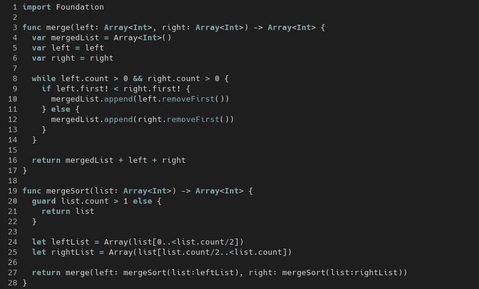

# Cyber Monochrome

This colorschreme is a fork of [vim-monochrome](https://github.com/fxn/vim-monochrome), and it's used on my dot files.
___
### Look & Feel
Gui colors, using Neovim with `set termguicolors`:


___
### Installation

Installation depends on how you manage packages. For example, with
[vim-plug](https://github.com/junegunn/vim-plug) add

```
Plug 'Mth-Ryan/cyber-monochrome'
```

to your init file.
___
### Configuration

Just throw this to your _~/.vimrc_ or ._~/.config/nvim/init.vim:

    colorscheme cmonochrome

Comments can optionally be rendered using italics:

    let g:monochrome_italic_comments = 1
    colorscheme cmonochrome

It is important that the flag is set before loading the theme.

